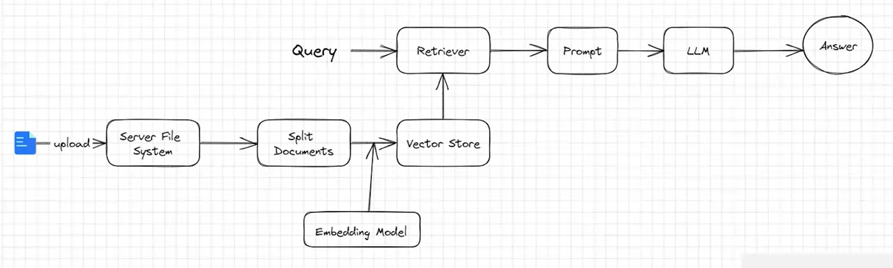

# RAG知识库的搭建

## RAG工作流程图


一个典型的RAG应用有两个主要组成部分：

1.**索引(Indexing)**:从数据源获取数据并建立索引的管道(pipeline)。这通常在离线状态下进行。\
2.**检索和生成(Retrieval and generation)**:实际的RAG链，在运行时接收用户查询，从索引中检索相关数据，然后将其传递给模型。

## RAG知识库搭建步骤


第一步：加载索引(Indexing)：\
**1.加载(Load)**：首先我们需要加载数据。这是通过文档加载器document_Loaders完成的。\
**2.分割(Split)**：文本分割器Text_splitters将大型文档( Documents )分成更小的块(chunks)。这对于索引数据和将其传递给模型都很有用，因为大块数据更难搜索，而且不适合模型有限的上下文窗口。\
**3.存储(Store)**：我们需要一个地方来存储和索引我们的分割(splits)，以便后续可以对其进行搜索。这通常使用向量存储VectorStore和嵌入模型Embeddings模型来完成。


第二步：检索和生成(Retrievaland generation)：\
**1.检索(Retrieve)**：给定用户输入，使用检索器Retriever从存储中检索相关的文本片段。\
**2.生成(Generate)**：ChatModel使用包含问题和检索到的数据的提示来生成答案。

## 实现流程


一个 RAG 程序的 APP 主要有以下流程：\
1.用户在 RAG 客户端上传一个txt文件。\
2.服务器端接收客户端文件，存储在服务端。\
3.服务器端程序对文件进行读取。\
4.对文件内容进行拆分，防止一次性塞给 Embedding 模型超 token 限制。\
5.把 Embedding 后的内容存储在向量数据库，生成检索器。\
6.程序准备就绪，允许用户进行提问。\
7.用户提出问题，大模型调用检索器检索文档，把相关片段找出来后，组织后，回复用户。


## 使用LangChain实现RAG

```python
from langchain_community.document_loaders import DirectoryLoader
from langchain_text_splitters import RecursiveCharacterTextSplitter
from langchain_huggingface import HuggingFaceEmbeddings
from langchain_community.vectorstores import FAISS
from langchain_openai import ChatOpenAI
from langchain_core.prompts import ChatPromptTemplate
from langchain_core.output_parsers import StrOutputParser

# 1. 加载文档
loader = DirectoryLoader("./documents", glob="**/*.pdf")
documents = loader.load()

# 2. 文本分块
text_splitter = RecursiveCharacterTextSplitter(chunk_size=1000, chunk_overlap=200)
chunks = text_splitter.split_documents(documents)

# 3. 创建嵌入
embeddings = HuggingFaceEmbeddings(model_name="your_embedding_model")

# 4. 创建向量存储
vectorstore = FAISS.from_documents(chunks, embeddings)

# 5. 创建检索器
retriever = vectorstore.as_retriever()

# 6. 创建LLM
llm = ChatOpenAI()

# 7. 创建提示模板
prompt = ChatPromptTemplate.from_template("""
请根据以下信息回答用户的问题:

{context}

用户问题: {question}
""")

# 8. 创建RAG链
rag_chain = (
    {"context": retriever, "question": lambda x: x["question"]}
    | prompt
    | llm
    | StrOutputParser()
)

# 9. 执行查询
response = rag_chain.invoke({"question": "用户问题"})
print(response)
```
